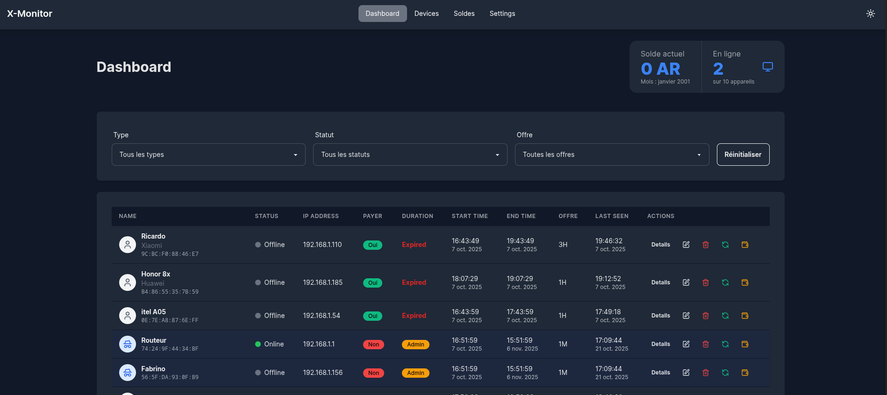

[](https://nodejs.org/)
[](https://reactjs.org/)
[](https://www.typescriptlang.org/)
[](https://www.mongodb.com/)





> **X-Monitor** est une solution complète de monitoring réseau Wi-Fi combinée à un système de gestion de soldes pour cybercafés ou espaces de coworking. Le système surveille en temps réel les appareils connectés et gère automatiquement les soldes utilisateurs selon les offres souscrites.

## 🌟 Fonctionnalités Principales

### Monitoring Réseau
- **Détection automatique** des appareils connectés via ARP et ping sweeps
- **Surveillance temps réel** avec Server-Sent Events (SSE)
- **Historique des sessions** avec calcul automatique des durées
- **Gestion des types d'utilisateurs** (Admin/Utilisateur)
- **Interface web moderne** avec filtres avancés

### Système de Gestion de Soldes
- **Gestion automatique** des soldes basée sur les offres choisies
- **Multiples offres** : 1H, 3H, 4H, 1D, 1S, 2S, 3S, 1M
- **Calcul automatique** des tarifs selon l'offre sélectionnée
- **Historique des transactions** avec références détaillées
- **Gestion mensuelle** des soldes avec archivage automatique

## 🏗️ Architecture

```
x-monitor/
├── x-monitor-back/     # API REST Backend
│   ├── src/
│   │   ├── controllers/    # Gestion des requêtes HTTP
│   │   ├── model/         # Modèles de données MongoDB
│   │   ├── lib/           # Utilitaires et services
│   │   ├── validators/    # Validation des données
│   │   ├── routes.js      # Définition des routes API
│   │   ├── scanner.js     # Scanner réseau
│   │   └── store.js       # Gestion des données en mémoire
│   └── package.json
│
├── x-monitor-front/    # Application Frontend React
│   ├── src/
│   │   ├── components/    # Composants React réutilisables
│   │   ├── pages/        # Pages principales de l'application
│   │   ├── store/        # Gestion d'état (Zustand)
│   │   ├── hooks/        # Hooks personnalisés
│   │   ├── services/     # Services API
│   │   └── types/        # Définitions TypeScript
│   ├── public/           # Assets statiques
│   └── package.json
│
└── README.md
```

## 🚀 Technologies Utilisées

### Backend
- **Node.js 18+** - Environnement d'exécution JavaScript
- **Express.js** - Framework web pour l'API REST
- **MongoDB + Mongoose** - Base de données NoSQL
- **Socket.IO** - Communication temps réel
- **Express Validator** - Validation des données
- **Multicast DNS** - Découverte réseau
- **OUI Database** - Identification des constructeurs par MAC

### Frontend
- **React 19** - Bibliothèque UI
- **TypeScript 5.8** - Typage statique
- **Vite** - Outil de build rapide
- **React Router** - Gestion du routage
- **React Query (TanStack)** - Gestion des requêtes API
- **Zustand** - Gestion d'état légère
- **DaisyUI + Tailwind CSS** - Framework CSS moderne
- **React Hot Toast** - Notifications utilisateur
- **Socket.IO Client** - Communication temps réel
- **Date-fns** - Manipulation des dates

## 📋 Prérequis

- **Linux** (utilise les outils système `ip`, `ping`)
- **Node.js 18+**
- **MongoDB** (local ou cloud)
- **Accès réseau** (interface Wi-Fi pour le monitoring)

## ⚙️ Installation et Configuration

### Backend

1. **Naviguer vers le dossier backend :**
   ```bash
   cd x-monitor-back
   ```

2. **Installer les dépendances :**
   ```bash
   npm install
   ```

3. **Configurer l'environnement :**
   ```bash
   cp .env.example .env
   ```

   Modifier le fichier `.env` selon vos besoins :
   ```env
   PORT=3000
   SCAN_INTERVAL_MS=10000
   OFFLINE_TIMEOUT_MS=30000
   NETWORK_CIDR=192.168.1.0/24
   NET_IFACE=wlan0
   MONGODB_URI=mongodb://localhost:27017/x-monitor
   ```

4. **Démarrer le serveur :**
   ```bash
   # Mode développement
   npm run dev

   # Mode production
   npm start
   ```

### Frontend

1. **Naviguer vers le dossier frontend :**
   ```bash
   cd x-monitor-front
   ```

2. **Installer les dépendances :**
   ```bash
   npm install
   ```

3. **Configurer l'environnement :**
   Modifier le fichier `.env` :
   ```env
   VITE_API_URL=http://localhost:3000
   ```

4. **Démarrer l'application :**
   ```bash
   npm run dev
   ```

## 🔌 API Endpoints

### Appareils (Devices)

| Méthode | Endpoint | Description |
|---------|----------|-------------|
| GET | `/api/devices` | Liste des appareils connus |
| GET | `/api/devices/:id` | Détail d'un appareil |
| POST | `/api/scan` | Déclencher un scan manuel |
| GET | `/api/stream` | Flux temps réel (SSE) |

### Soldes (Balance)

| Méthode | Endpoint | Description |
|---------|----------|-------------|
| GET | `/api/soldes` | Liste des soldes mensuels |
| GET | `/api/soldes/current` | Solde actuel |
| POST | `/api/soldes` | Créer un nouveau solde mensuel |
| PUT | `/api/soldes/:id` | Mettre à jour un solde |

### Informations générales

| Méthode | Endpoint | Description |
|---------|----------|-------------|
| GET | `/` | Informations du service |
| GET | `/api/health` | État du scanner |

## 💰 Système de Tarification

Le système inclut un système de tarification automatique basé sur les offres :

| Offre | Durée | Prix (AR) |
|-------|-------|-----------|
| 1H | 1 Heure | 500 |
| 3H | 3 Heures | 1 000 |
| 4H | 4 Heures | 1 500 |
| 1D | 1 Jour | 2 000 |
| 1S | 1 Semaine | 5 000 |
| 2S | 2 Semaines | 10 000 |
| 3S | 3 Semaines | 15 000 |
| 1M | 1 Mois | 20 000 |

## 🎯 Fonctionnalités Avancées

### Gestion des Appareils
- **Classification automatique** des appareils (Admin/Utilisateur)
- **Gestion des sessions** avec calcul automatique des durées
- **Notifications temps réel** lors de l'expiration des sessions
- **Historique détaillé** des connexions et déconnexions

### Interface Utilisateur
- **Dashboard responsive** avec statistiques en temps réel
- **Filtres avancés** (type, statut, offre)
- **Gestion des paiements** intégrée
- **Thème sombre/clair** personnalisable
- **Interface française** complète

### Sécurité et Performance
- **Validation stricte** des données côté serveur
- **Gestion des erreurs** complète avec messages utilisateur
- **Optimisation des performances** avec React Query
- **Architecture modulaire** pour faciliter la maintenance

## 🔧 Configuration Avancée

### Variables d'environnement Backend

```env
# Serveur
PORT=3000

# Scanner réseau
SCAN_INTERVAL_MS=10000
OFFLINE_TIMEOUT_MS=30000
NETWORK_CIDR=192.168.1.0/24
NET_IFACE=wlan0

# Base de données
MONGODB_URI=mongodb://localhost:27017/x-monitor

# Sécurité (optionnel)
JWT_SECRET=votre-secret-jwt
```

### Variables d'environnement Frontend

```env
VITE_API_URL=http://localhost:3000
```

## 🚨 Limitations

- **Linux uniquement** : Utilise les outils système Linux (`ip`, `ping`)
- **Privilèges réseau** : Nécessite l'accès aux interfaces réseau
- **Résolution MAC partielle** : Peut être limitée selon la configuration réseau


## 🤝 Contribution

1. Fork le projet
2. Créer une branche (`git checkout -b feature/AmazingFeature`)
3. Commit les changements (`git commit -m 'Add some AmazingFeature'`)
4. Push la branche (`git push origin feature/AmazingFeature`)
5. Ouvrir une Pull Request

## 📝 Historique des Versions

### v1.0.0
- ✅ Monitoring réseau temps réel
- ✅ Système de gestion de soldes
- ✅ Interface web moderne
- ✅ API REST complète
- ✅ Support TypeScript

## 📄 Licence

Ce projet est sous licence MIT - voir le fichier [LICENSE](LICENSE) pour plus de détails.

## 🆘 Support

Pour toute question ou problème :
- Créer une issue sur GitHub
- Consulter la documentation API
- Vérifier les logs d'application

---

**Développé avec ❤️ pour les cybercafés et espaces de coworking**"
}
